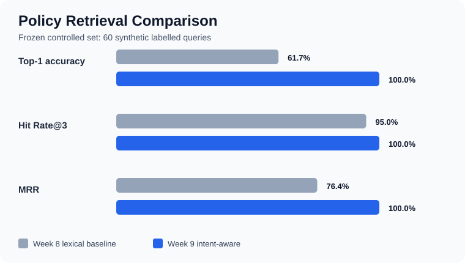
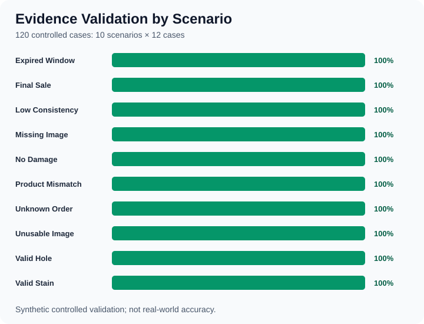

# Member 3 Week 9 Final Retrieval and Evidence Report

## Objective

Finalise the Member 3 order, policy retrieval, and evidence verification layer
for the stable research prototype. This work compares the frozen Week 8
lexical baseline with a deterministic intent-aware retriever and verifies that
the evidence rules still produce the expected outcomes across the controlled
Member 3 cases.

## Final system responsibility

Member 3 receives structured claim and image-analysis outputs from the earlier
modules. It retrieves the matching order and policy, checks evidence
completeness and policy eligibility, and returns traceable features to the
decision module. Member 3 does not train the image model and does not approve a
real refund.

## Retrieval refinement

The Week 8 baseline ranked policies by token overlap. Error analysis showed
that negated damage language, final-sale exclusions, and wrong-item phrases
were often ranked behind generic damage policies. The Week 9 refinement keeps
the lexical score and adds high-precision intent routing for four policy
families:

- damaged item;
- wrong item;
- no visible damage;
- final-sale exclusion.

Exclusion and negation patterns are evaluated before generic damage words so a
phrase such as "no visible hole" is not treated as positive damage evidence.

## Controlled evaluation

The primary controlled evaluation contains 180 cases:

- 60 synthetic labelled retrieval queries, with 15 queries for each policy
  family;
- 120 synthetic evidence-verification cases, with 12 cases in each of 10
  scenarios.

The 10 evidence scenarios cover valid hole evidence, valid stain evidence,
missing images, unusable images, no visible damage, low claim-image
consistency, product mismatch, expired requests, final-sale items, and unknown
orders. The original 12-case evidence set remains as a separate regression
smoke test covering legacy labels and edge conditions.

The prototype order database contains 120 synthetic demo records. The original
`ORD001`-`ORD012` records are preserved for backward compatibility, while
`ORD013`-`ORD120` are deterministic generated records covering different
products, prices, dates, delivery states, and final-sale flags. These are UI
seed records, not real orders and not additional validation cases.

Final values are generated in
`data/results/member3_week9_final_results.json`. They must be interpreted as
controlled prototype results rather than real-world model accuracy.

| Metric | Week 8 lexical baseline | Week 9 intent-aware |
| --- | ---: | ---: |
| Top-1 accuracy | 61.7% | 100.0% |
| Hit Rate@3 | 95.0% | 100.0% |
| Mean Reciprocal Rank | 0.764 | 1.000 |
| Top-1 failures | 23 | 0 |



All 23 baseline Top-1 failures were resolved on the frozen controlled set, and
no new regression case was introduced. Each of the four policy families
reached 100% Top-1 accuracy on its 15 synthetic examples. This result shows
that the targeted routing rules address the known Week 8 errors; it does not
estimate performance on unseen real customer language.

## Stable prototype checks

The final regression confirms that Member 3 can:

- retrieve known orders and return a clear unknown-order outcome;
- retrieve a traceable mock policy source;
- check delivery status, refund window, final-sale status, image presence,
  image usability, detected damage, claim-image consistency, damage coverage,
  and product-order consistency;
- produce evidence completeness, policy match, eligibility, refund amount,
  and a human-readable reason;
- pass the structured output to the downstream risk-aware decision module.

All 120 primary evidence cases matched both their expected eligibility labels
and expected reason categories: 24 true positives, 96 true negatives, zero
false positives, and zero false negatives. Every scenario achieved a 100% pass
rate on this deterministic controlled set. The original 12 regression cases
also passed.



The focused automated test suite completed successfully. An additional
Student 4 visual-pipeline test requires the optional Pillow dependency and is
therefore reported separately from the dependency-free Member 3 test result.

## Reproduce the results

From the repository root, run:

```bash
python3 -B scripts/member3_generate_mock_orders.py
python3 -B scripts/member3_week9_generate_evidence_dataset.py
python3 -B scripts/member3_week9_final_evaluation.py
python3 -B scripts/member3_week9_generate_figures.py
.venv/bin/python -B -m pytest -q \
  tests/test_member3_week4_week5.py \
  tests/test_member3_week6_pipeline.py \
  tests/test_adopted_evidence_rules.py \
  tests/test_member3_week7_week8.py \
  tests/test_member3_week9_final.py
```

## Limitations and next steps

The policy corpus and evaluation cases remain small and controlled. The
intent-aware method is deterministic, not a trained RAG model, and its results
must not be presented as production accuracy. A future study should freeze a
larger independent test set, add paraphrases and adversarial claims, compare a
pretrained embedding retriever, and evaluate the complete image-to-decision
pipeline using real consented data and human review.

The browser UI currently demonstrates Member 3 with structured mock outputs
from the upstream image modules. Real image inference exists as a separate
agent pipeline integration and still requires the optional vision dependencies
and model files before it can replace the UI mock features.
